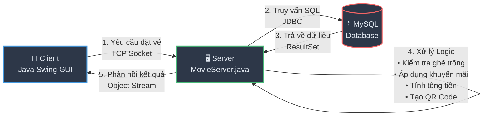
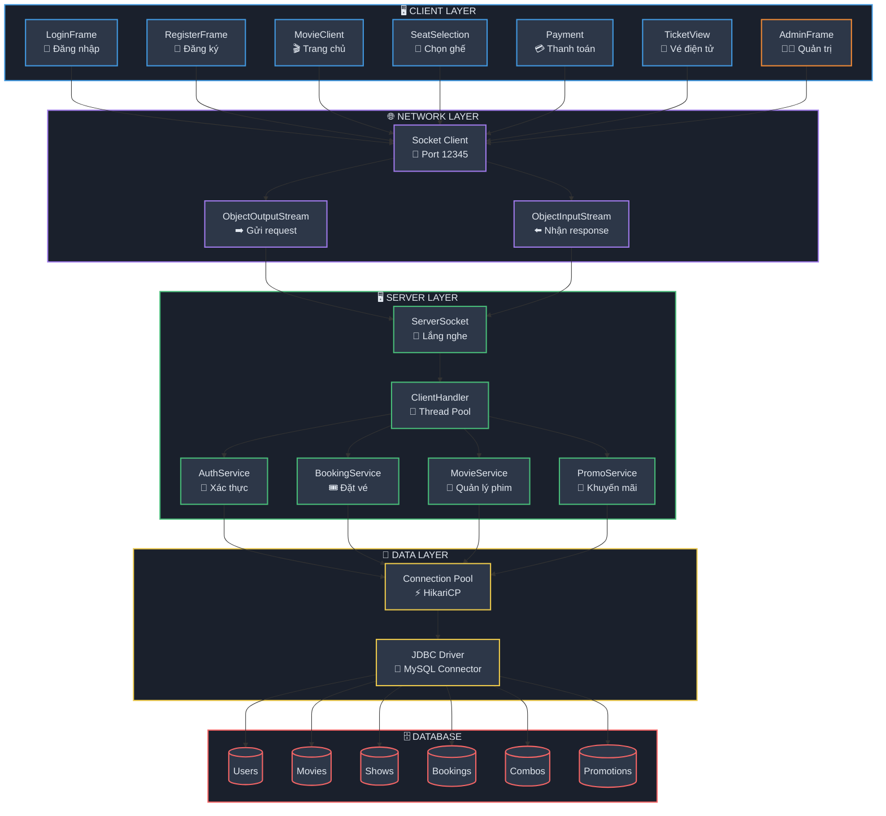

<h2 align="center">
    <a href="https://dainam.edu.vn/vi/khoa-cong-nghe-thong-tin">
    🎓 Faculty of Information Technology (DaiNam University)
    </a>
</h2>
<h2 align="center">
   NETWORK PROGRAMMING
</h2>
<div align="center">
    <p align="center">
        
        
        
    </p>

[](https://www.facebook.com/DNUAIoTLab)
[](https://dainam.edu.vn/vi/khoa-cong-nghe-thong-tin)
[](https://dainam.edu.vn)

</div>
<h1 align="center">ỨNG DỤNG ĐẶT VÉ XEM PHIM</h1>

---

# 📖 1. Giới thiệu

## 1.1. Tổng Quan Dự Án
Hệ thống **Cinema Booking** là một giải pháp phần mềm hiện đại được thiết kế để hỗ trợ người dùng đặt vé xem phim trực tuyến thông qua mô hình **máy khách – máy chủ (Client-Server)**. Ứng dụng không chỉ cung cấp trải nghiệm đặt vé thuận tiện mà còn tích hợp các tính năng quản lý toàn diện cho cả người dùng và quản trị viên.

### 🎯 Mục Tiêu Dự Án
- **Tự động hóa quy trình đặt vé**: Giảm thiểu thời gian và công sức cho khách hàng
- **Quản lý tập trung**: Hệ thống quản lý thống nhất cho suất chiếu, ghế ngồi, và doanh thu
- **Trải nghiệm người dùng**: Giao diện trực quan, dễ sử dụng với Java Swing
- **Bảo mật dữ liệu**: Xác thực người dùng, mã hóa thông tin thanh toán
- **Khả năng mở rộng**: Kiến trúc client-server cho phép mở rộng số lượng người dùng

## 1.2. Kiến Trúc Hệ Thống

### 🏗️ Mô Hình Client-Server
Đề tài tập trung xây dựng hệ thống theo kiến trúc phân tán với ba tầng chính:

#### **1. Tầng Máy Chủ (Server Layer)**
- **Vai trò**: Trung tâm xử lý logic nghiệp vụ và quản lý dữ liệu
- **Chức năng chính**:
  - Xử lý yêu cầu từ nhiều client đồng thời thông qua đa luồng (multithreading)
  - Quản lý kết nối và truy vấn cơ sở dữ liệu MySQL
  - Xác thực người dùng (login, register)
  - Kiểm tra tính khả dụng của ghế ngồi
  - Xử lý logic thanh toán, áp dụng khuyến mãi
  - Ghi nhận lịch sử đặt vé và thống kê doanh thu
- **Công nghệ**: Java Socket Programming, JDBC, MySQL

#### **2. Tầng Máy Khách (Client Layer)**
- **Vai trò**: Giao diện tương tác với người dùng cuối
- **Chức năng chính**:
  - Hiển thị danh sách phim đang chiếu, sắp chiếu
  - Xem trailer phim trực tuyến
  - Chọn suất chiếu, ghế ngồi theo sơ đồ phòng chiếu
  - Chọn combo bắp nước và áp dụng mã khuyến mãi
  - Hiển thị vé điện tử với mã QR
  - Quản lý lịch sử đặt vé
- **Công nghệ**: Java Swing, AWT, Event Handling

#### **3. Tầng Cơ Sở Dữ Liệu (Database Layer)**
- **Vai trò**: Lưu trữ và quản lý dữ liệu bền vững
- **Các bảng chính**:
  - `Users`: Thông tin tài khoản người dùng (email, mật khẩu, vai trò)
  - `Movies`: Thông tin phim (tên, thể loại, thời lượng, poster, trailer URL)
  - `Rooms`: Phòng chiếu (số lượng ghế, loại phòng)
  - `Shows`: Suất chiếu (thời gian, phòng, giá vé)
  - `Bookings`: Đơn đặt vé (người dùng, suất chiếu, ghế, trạng thái)
  - `Combos`: Combo bắp nước (tên, giá, mô tả)
  - `Promotions`: Khuyến mãi (mã giảm giá, phần trăm, điều kiện áp dụng)
  - `OrderCombos`: Chi tiết combo trong đơn hàng
  - `BookingPromos`: Áp dụng khuyến mãi cho đơn hàng
- **Ràng buộc**: Foreign Key, Unique Constraint, Check Constraint để đảm bảo tính toàn vẹn

### 🔄 Luồng Hoạt Động



**Chi Tiết Luồng Xử Lý:**

```mermaid
%%{init: {'theme':'dark'}}%%
sequenceDiagram
    participant C as 👤 Client
    participant S as 🖥️ Server
    participant DB as 🗄️ Database
    
    Note over C,DB: 🎬 Quy Trình Đặt Vé Xem Phim
    
    C->>+S: 1️⃣ Kết nối Socket (Port 12345)
    S-->>-C: ✅ Kết nối thành công
    
    C->>+S: 2️⃣ Yêu cầu Danh sách phim
    S->>+DB: SELECT * FROM Movies<br/>WHERE status='NOW_SHOWING'
    DB-->>-S: 📊 Dữ liệu phim
    S-->>-C: 🎥 Trả về danh sách phim
    
    C->>+S: 3️⃣ Chọn phim & suất chiếu
    S->>+DB: SELECT * FROM Shows<br/>WHERE movieId=X
    DB-->>-S: 📅 Danh sách suất chiếu
    S-->>-C: 🕐 Trả về suất chiếu
    
    C->>+S: 4️⃣ Xem sơ đồ ghế
    S->>+DB: SELECT seat_row, seat_col<br/>FROM Bookings WHERE showId=Y
    DB-->>-S: 💺 Ghế đã đặt
    S-->>-C: 🪑 Sơ đồ ghế (Available/Booked)
    
    C->>+S: 5️⃣ Đặt vé Ghế A1, A2 + Combo + Mã KM
    
    rect rgb(45, 55, 72)
        Note over S: 🔄 Xử lý nghiệp vụ
        S->>S: Kiểm tra ghế còn trống
        S->>+DB: SELECT ... FOR UPDATE (Lock ghế)
        DB-->>-S: ✅ Ghế available
        
        S->>S: Áp dụng khuyến mãi
        S->>+DB: SELECT * FROM Promotions<br/>WHERE promoCode='XXXX'
        DB-->>-S: 🎟️ Giảm 20%
        
        S->>S: Tính tổng tiền
        S->>S: Tạo QR Code
        
        S->>+DB: BEGIN TRANSACTION
        S->>DB: INSERT INTO Bookings (ghế A1)
        S->>DB: INSERT INTO Bookings (ghế A2)
        S->>DB: INSERT INTO OrderCombos
        S->>DB: INSERT INTO BookingPromos
        S->>DB: UPDATE Promotions (usedCount++)
        DB-->>-S: COMMIT ✅
    end
    
    S-->>-C: 6️⃣ ✅ Đặt vé thành công<br/>+ QR Code + Booking ID + Tổng tiền
    
    C->>C: 🎫 Hiển thị vé điện tử
    
    Note over C,DB: ✨ Hoàn tất giao dịch
```



**Sơ Đồ Kiến Trúc Tổng Quan:**



> **💡 Lưu ý:** Sơ đồ Mermaid sẽ được render tự động trên GitHub, GitLab, và các nền tảng hỗ trợ Markdown. Nếu xem trên editor không hỗ trợ, vui lòng xem trên GitHub repository.

## 1.3. Tính Năng Chính

### 👤 **Dành Cho Người Dùng**
1. **Xác thực & Quản lý tài khoản**
   - Đăng ký tài khoản mới với xác thực email
   - Đăng nhập bảo mật với mã hóa mật khẩu
   - Quên mật khẩu và khôi phục tài khoản

2. **Khám phá phim**
   - Xem danh sách phim đang chiếu, sắp chiếu, phim đặc biệt
   - Xem thông tin chi tiết phim (thể loại, thời lượng, diễn viên, đạo diễn)
   - Xem trailer phim trực tuyến

3. **Đặt vé thông minh**
   - Chọn suất chiếu theo ngày giờ
   - Xem sơ đồ phòng chiếu real-time
   - Chọn ghế theo loại: Standard, VIP, Couple
   - Ghế đã đặt được đánh dấu tự động
   - Tính toán giá vé theo loại ghế

4. **Combo & Khuyến mãi**
   - Chọn combo bắp nước đa dạng
   - Nhập mã khuyến mãi để giảm giá
   - Xem chi tiết giá và tổng tiền trước khi thanh toán

5. **Vé điện tử**
   - Tạo vé điện tử với mã QR
   - Lưu trữ lịch sử đặt vé
   - Xem lại thông tin vé bất kỳ lúc nào
   - Sao chép thông tin ghế để chia sẻ

### 🔐 **Dành Cho Quản Trị Viên**
1. **Dashboard thống kê**
   - Tổng doanh thu theo ngày/tuần/tháng
   - Số lượng vé bán ra
   - Số lượng người dùng đăng ký
   - Top phim bán chạy nhất

2. **Quản lý phim & suất chiếu**
   - Thêm/Sửa/Xóa phim
   - Tạo và quản lý suất chiếu
   - Cập nhật giá vé theo khung giờ

3. **Quản lý phòng chiếu**
   - Thêm/Sửa/Xóa phòng chiếu
   - Cấu hình sơ đồ ghế ngồi
   - Đặt giá cho từng loại ghế

4. **Quản lý combo & khuyến mãi**
   - Thêm/Sửa/Xóa combo bắp nước
   - Tạo mã khuyến mãi theo chiến dịch
   - Theo dõi hiệu quả khuyến mãi

5. **Biểu đồ & Báo cáo**
   - Biểu đồ doanh thu theo thời gian
   - Biểu đồ số lượng vé bán
   - Tỷ lệ công suất phòng chiếu
   - Xuất báo cáo Excel/PDF

## 1.4. Lợi Ích & Ứng Dụng

### ✅ **Lợi Ích**
- **Tiết kiệm thời gian**: Đặt vé nhanh chóng, không cần xếp hàng
- **Minh bạch**: Xem rõ sơ đồ ghế, giá vé trước khi thanh toán
- **Quản lý hiệu quả**: Tự động hóa quy trình quản lý rạp phim
- **Dữ liệu tập trung**: Thống kê doanh thu, báo cáo chi tiết
- **Trải nghiệm tốt**: Giao diện thân thiện, dễ sử dụng

### 🎓 **Ứng Dụng Thực Tiễn**
- Rạp chiếu phim nhỏ và vừa
- Dự án học tập môn Lập trình mạng
- Mô hình triển khai hệ thống phân tán
- Nền tảng cho các dự án tương tự (đặt vé sự kiện, đặt phòng khách sạn)

📊 **Điểm Nổi Bật Kỹ Thuật**  
- ✅ Xây dựng hệ thống đặt vé xem phim theo mô hình client-server  
- ✅ Triển khai giao thức TCP/IP cho việc truyền thông tin đặt vé đáng tin cậy  
- ✅ Phát triển giao diện người dùng bằng Java Swing với UX/UI trực quan
- ✅ Kết nối cơ sở dữ liệu MySQL với JDBC để lưu trữ và truy vấn dữ liệu
- ✅ Đảm bảo tính toàn vẹn dữ liệu với khóa ngoại và ràng buộc quan hệ  
- ✅ Xử lý đa luồng (multithreading) cho nhiều client đồng thời
- ✅ Hỗ trợ khuyến mãi linh hoạt, combo bắp nước đa dạng
- ✅ Tạo QR Code xác nhận vé điện tử với thư viện ZXing
- ✅ Bảo mật mật khẩu với mã hóa
- ✅ Cache hình ảnh và video trailer để tối ưu hiệu suất  

---

# 🔧 2. Công Nghệ Sử Dụng

## 2.1. Ngôn Ngữ Lập Trình [](https://www.java.com/)

### **Java SE 17+** - Nền Tảng Phát Triển
- **Lý do chọn Java**:
  - Đa nền tảng (cross-platform) - chạy trên Windows, Linux, macOS
  - Hỗ trợ lập trình hướng đối tượng mạnh mẽ
  - Thư viện phong phú cho network programming và database connectivity
  - Cộng đồng phát triển lớn, tài liệu đầy đủ
  
- **Tính năng được sử dụng**:
  - **Hướng đối tượng (OOP)**: Encapsulation, Inheritance, Polymorphism
  - **Đa luồng (Multithreading)**: Xử lý nhiều client đồng thời
  - **Exception Handling**: Xử lý lỗi an toàn và rõ ràng
  - **Collections Framework**: ArrayList, HashMap để quản lý dữ liệu
  - **Stream API**: Xử lý dữ liệu hiệu quả
  
- **Ứng dụng trong dự án**:
  - Viết toàn bộ server-side logic
  - Phát triển client application với GUI
  - Xử lý business logic (tính toán giá vé, áp dụng khuyến mãi)
  - Kết nối và truy vấn cơ sở dữ liệu

## 2.2. Giao Diện Người Dùng

### **Java Swing** - Framework GUI Desktop
- **Thư viện chính**: `javax.swing`, `java.awt`
- **Ưu điểm**:
  - Native desktop application với hiệu năng cao
  - Tích hợp sẵn trong Java SDK, không cần cài đặt thêm
  - Hỗ trợ Look and Feel đa dạng
  - Phù hợp cho ứng dụng client-server

### **Các Component Chính**

#### **Container Components**
- **JFrame**: Cửa sổ chính của ứng dụng
  - `LoginFrame`: Giao diện đăng nhập
  - `RegisterFrame`: Giao diện đăng ký
  - `MovieClient`: Giao diện chính xem phim
  - `AdminFrame`: Giao diện quản trị
  - `TrailerWindow`: Cửa sổ xem trailer

- **JPanel**: Container con để tổ chức layout
  - Panel hiển thị danh sách phim
  - Panel sơ đồ chọn ghế
  - Panel thông tin thanh toán
  - Panel thống kê admin

#### **Interactive Components**
- **JButton**: Nút bấm (Đặt vé, Thanh toán, Chọn ghế...)
- **JTable**: Hiển thị bảng dữ liệu (Lịch sử đặt vé, Danh sách suất chiếu)
- **JTextField**: Nhập liệu văn bản (Email, Số điện thoại, Mã khuyến mãi)
- **JPasswordField**: Nhập mật khẩu bảo mật
- **JComboBox**: Dropdown chọn lựa (Ngày chiếu, Giờ chiếu)
- **JCheckBox**: Lựa chọn đa lựa chọn (Combo bắp nước)
- **JLabel**: Hiển thị text và hình ảnh (Poster phim, Thông tin)
- **JTextArea**: Hiển thị văn bản nhiều dòng (Mô tả phim)
- **JScrollPane**: Cuộn nội dung dài

#### **Layout Managers**
- **BorderLayout**: Chia giao diện thành 5 vùng (North, South, East, West, Center)
- **GridLayout**: Bố cục dạng lưới (Sơ đồ ghế ngồi)
- **FlowLayout**: Sắp xếp component theo dòng
- **BoxLayout**: Sắp xếp theo chiều dọc hoặc ngang
- **GridBagLayout**: Bố cục phức tạp, linh hoạt

### **Xử Lý Sự Kiện (Event Handling)**
- **ActionListener**: Bắt sự kiện click button, menu
  ```java
  bookButton.addActionListener(e -> handleBooking());
  ```
- **MouseListener**: Bắt sự kiện chuột (click ghế, hover poster)
- **KeyListener**: Bắt sự kiện bàn phím (Enter để login)
- **WindowListener**: Xử lý sự kiện đóng/mở cửa sổ

### **Custom UI Components**
- **SeatButton**: Button tùy chỉnh hiển thị trạng thái ghế
  - Màu xám: Ghế đã đặt
  - Màu xanh: Ghế thường
  - Màu đỏ: Ghế VIP
  - Màu hồng: Ghế đôi
- **MoviePanel**: Panel hiển thị thông tin phim với poster, tên, rating
- **TicketPanel**: Panel hiển thị vé điện tử với QR code

## 2.3. Truyền Thông Mạng

### **Giao Thức TCP/IP**
- **Lý do chọn TCP**:
  - Đảm bảo truyền dữ liệu tin cậy (reliable)
  - Kiểm soát luồng và xử lý lỗi tự động
  - Phù hợp cho giao dịch đặt vé cần độ chính xác cao

### **Java Socket Programming**
- **Server-side**:
  - `ServerSocket`: Lắng nghe kết nối trên port 12345
  - Chấp nhận kết nối từ client
  - Tạo thread riêng cho mỗi client (Multi-client support)
  
- **Client-side**:
  - `Socket`: Kết nối đến server
  - Gửi yêu cầu và nhận phản hồi

### **Cơ Chế Truyền Dữ Liệu**
- **ObjectInputStream**: Đọc object từ socket
- **ObjectOutputStream**: Ghi object vào socket
- **Serialization**: Chuyển đổi object Java thành byte stream
  - Các class dữ liệu implement `Serializable`
  - Truyền object phức tạp (Booking, Movie, User...)

### **Định Dạng Giao Thức**
```
Client Request Format:
{
  "action": "BOOK_TICKET",
  "data": {
    "showId": 123,
    "seats": ["A1", "A2"],
    "combos": [1, 2],
    "promoCode": "DISCOUNT20"
  }
}

Server Response Format:
{
  "status": "SUCCESS",
  "message": "Booking completed",
  "data": {
    "bookingId": 456,
    "qrCode": "base64_encoded_qr",
    "totalPrice": 250000
  }
}
```

### **Port & Connection**
- **Port**: 12345 (có thể cấu hình)
- **Timeout**: 30 giây cho mỗi request
- **Connection pooling**: Tối đa 100 kết nối đồng thời

## 2.4. Cơ Sở Dữ Liệu

### **MySQL 8+** - Hệ Quản Trị CSDL
- **Lý do chọn MySQL**:
  - Mã nguồn mở, miễn phí
  - Hiệu năng cao, ổn định
  - Hỗ trợ transaction (ACID)
  - Dễ cài đặt và sử dụng

### **JDBC (Java Database Connectivity)**
- **Driver**: `mysql-connector-java-8.0.33.jar`
- **Connection String**:
  ```java
  jdbc:mysql://localhost:3306/cinema?useUnicode=true&characterEncoding=utf8
  ```
- **Các thành phần JDBC**:
  - `Connection`: Kết nối đến database
  - `Statement`: Thực thi câu lệnh SQL
  - `PreparedStatement`: Câu lệnh có tham số (tránh SQL Injection)
  - `ResultSet`: Kết quả truy vấn

### **Lược Đồ Cơ Sở Dữ Liệu**

#### **Bảng `Users`** - Quản lý người dùng
```sql
CREATE TABLE Users (
  email VARCHAR(100) PRIMARY KEY,
  password VARCHAR(255) NOT NULL,
  fullName VARCHAR(100),
  phone VARCHAR(20),
  role ENUM('USER', 'ADMIN') DEFAULT 'USER',
  created_at TIMESTAMP DEFAULT CURRENT_TIMESTAMP
);
```

#### **Bảng `Movies`** - Thông tin phim
```sql
CREATE TABLE Movies (
  movieId INT PRIMARY KEY AUTO_INCREMENT,
  title VARCHAR(200) NOT NULL,
  genre VARCHAR(100),
  duration INT, -- phút
  releaseDate DATE,
  posterUrl VARCHAR(500),
  trailerUrl VARCHAR(500),
  description TEXT,
  rating DECIMAL(2,1), -- 0.0 - 10.0
  status ENUM('NOW_SHOWING', 'COMING_SOON', 'SPECIAL') DEFAULT 'NOW_SHOWING'
);
```

#### **Bảng `Rooms`** - Phòng chiếu
```sql
CREATE TABLE Rooms (
  roomId INT PRIMARY KEY AUTO_INCREMENT,
  roomName VARCHAR(50) NOT NULL,
  totalSeats INT NOT NULL,
  roomType ENUM('2D', '3D', 'IMAX') DEFAULT '2D'
);
```

#### **Bảng `Shows`** - Suất chiếu
```sql
CREATE TABLE Shows (
  showId INT PRIMARY KEY AUTO_INCREMENT,
  movieId INT NOT NULL,
  roomId INT NOT NULL,
  showDate DATE NOT NULL,
  showTime TIME NOT NULL,
  standardPrice DECIMAL(10,2),
  vipPrice DECIMAL(10,2),
  couplePrice DECIMAL(10,2),
  FOREIGN KEY (movieId) REFERENCES Movies(movieId) ON DELETE CASCADE,
  FOREIGN KEY (roomId) REFERENCES Rooms(roomId) ON DELETE CASCADE
);
```

#### **Bảng `Bookings`** - Đơn đặt vé
```sql
CREATE TABLE Bookings (
  bookingId INT PRIMARY KEY AUTO_INCREMENT,
  showId INT NOT NULL,
  email VARCHAR(100) NOT NULL,
  seat_row CHAR(1) NOT NULL,
  seat_col INT NOT NULL,
  seatType ENUM('STANDARD', 'VIP', 'COUPLE') DEFAULT 'STANDARD',
  price DECIMAL(10,2),
  bookingDate TIMESTAMP DEFAULT CURRENT_TIMESTAMP,
  status ENUM('PENDING', 'CONFIRMED', 'CANCELLED') DEFAULT 'CONFIRMED',
  FOREIGN KEY (showId) REFERENCES Shows(showId) ON DELETE CASCADE,
  FOREIGN KEY (email) REFERENCES Users(email) ON DELETE CASCADE,
  CONSTRAINT uq_bookings_seat UNIQUE (showId, seat_row, seat_col)
);
```

#### **Bảng `Combos`** - Combo bắp nước
```sql
CREATE TABLE Combos (
  comboId INT PRIMARY KEY AUTO_INCREMENT,
  comboName VARCHAR(100) NOT NULL,
  price DECIMAL(10,2) NOT NULL,
  description TEXT,
  imageUrl VARCHAR(500)
);
```

#### **Bảng `Promotions`** - Khuyến mãi
```sql
CREATE TABLE Promotions (
  promoId INT PRIMARY KEY AUTO_INCREMENT,
  promoCode VARCHAR(50) UNIQUE NOT NULL,
  discountPercent DECIMAL(5,2),
  minOrderAmount DECIMAL(10,2),
  maxDiscount DECIMAL(10,2),
  startDate DATE,
  endDate DATE,
  usageLimit INT,
  usedCount INT DEFAULT 0
);
```

#### **Bảng `OrderCombos`** - Chi tiết combo trong đơn
```sql
CREATE TABLE OrderCombos (
  orderComboId INT PRIMARY KEY AUTO_INCREMENT,
  bookingId INT NOT NULL,
  comboId INT NOT NULL,
  quantity INT DEFAULT 1,
  FOREIGN KEY (bookingId) REFERENCES Bookings(bookingId) ON DELETE CASCADE,
  FOREIGN KEY (comboId) REFERENCES Combos(comboId) ON DELETE CASCADE
);
```

#### **Bảng `BookingPromos`** - Áp dụng khuyến mãi
```sql
CREATE TABLE BookingPromos (
  bookingPromoId INT PRIMARY KEY AUTO_INCREMENT,
  bookingId INT NOT NULL,
  promoId INT NOT NULL,
  discountAmount DECIMAL(10,2),
  FOREIGN KEY (bookingId) REFERENCES Bookings(bookingId) ON DELETE CASCADE,
  FOREIGN KEY (promoId) REFERENCES Promotions(promoId) ON DELETE CASCADE
);
```

### **Các Thao Tác SQL**
- **SELECT**: Truy vấn dữ liệu (Danh sách phim, suất chiếu, ghế trống)
- **INSERT**: Thêm mới (Đăng ký user, tạo booking)
- **UPDATE**: Cập nhật (Trạng thái vé, số lượng sử dụng khuyến mãi)
- **DELETE**: Xóa (Hủy vé, xóa suất chiếu cũ)
- **JOIN**: Kết nối bảng (Lấy thông tin phim + suất chiếu + phòng)
- **Transaction**: Đảm bảo tính toàn vẹn khi đặt vé (commit/rollback)

### **Ràng Buộc Dữ Liệu**
- **PRIMARY KEY**: Khóa chính duy nhất
- **FOREIGN KEY**: Khóa ngoại đảm bảo tham chiếu
- **UNIQUE**: Ngăn trùng lặp (email, seat trong cùng suất chiếu)
- **CHECK**: Kiểm tra điều kiện (rating từ 0-10, giá > 0)
- **NOT NULL**: Bắt buộc nhập
- **DEFAULT**: Giá trị mặc định

## 2.5. Xử Lý Đa Luồng (Multithreading)

### **Java Multithreading**
- **Mục đích**: Cho phép server xử lý nhiều client đồng thời
- **Cơ chế**:
  ```java
  // Server tạo thread mới cho mỗi client
  ServerSocket serverSocket = new ServerSocket(12345);
  while (true) {
      Socket clientSocket = serverSocket.accept();
      new ClientHandler(clientSocket).start(); // Thread riêng
  }
  ```

### **Thread Pool**
- Sử dụng `ExecutorService` để quản lý thread pool
- Giới hạn số lượng thread tối đa (tránh quá tải)
- Tái sử dụng thread (giảm overhead)

### **Đồng Bộ Hóa (Synchronization)**
- **Vấn đề**: Nhiều client cùng đặt một ghế
- **Giải pháp**:
  - Sử dụng `synchronized` block/method
  - Transaction trong MySQL (BEGIN, COMMIT, ROLLBACK)
  - Unique constraint trong database
  ```java
  synchronized(this) {
      // Kiểm tra và đặt ghế
  }
  ```

### **Concurrency Control**
- **Pessimistic Locking**: Lock dữ liệu khi đọc (SELECT ... FOR UPDATE)
- **Optimistic Locking**: Kiểm tra version trước khi update
- **Retry mechanism**: Thử lại khi gặp conflict

## 2.6. Thư Viện & Công Cụ Bổ Sung

### **QR Code Generation**
- **Thư viện**: ZXing (Zebra Crossing)
- **Dependency**: `core-3.5.0.jar`, `javase-3.5.0.jar`
- **Chức năng**: Tạo mã QR cho vé điện tử
- **Nội dung QR**: Booking ID, Show Info, Seat Numbers

### **Video Player**
- **VLCJ**: Nhúng VLC Media Player vào Java Swing
- **Chức năng**: Phát trailer phim trực tuyến
- **Hỗ trợ**: MP4, AVI, MKV, streaming URL

### **Image Caching**
- **ImageCache.java**: Cache poster phim trong memory
- **VideoTrailerCache.java**: Cache video trailer
- **Lợi ích**: Giảm tải network, tăng tốc độ load

### **Build Tool**
- **Apache Maven**: Quản lý dependency và build project
- **pom.xml**: File cấu hình Maven
- **Plugins**: maven-compiler-plugin, maven-jar-plugin

### **Testing**
- **JUnit 5**: Unit testing
- **Mockito**: Mock object cho testing
- **AssertJ**: Assertion library

### **Logging**
- **SLF4J + Logback**: Ghi log ứng dụng
- **Log Level**: DEBUG, INFO, WARN, ERROR
- **Log File**: Lưu lịch sử hoạt động server  

--

# 🖼️ 3. Hình ảnh chức năng 

> Bạn có thể thay ảnh thật của project vào thư mục `docs/images/` với đúng tên file hoặc sửa đường dẫn bên dưới.

1. **Đăng nhập**
   - Người dùng nhập email + mật khẩu.
   - Kiểm tra thông tin trong bảng `Users`.
   - Nếu hợp lệ → chuyển sang giao diện đặt vé.

   

2. **Đăng ký**
   - Người dùng nhập email + mật khẩu.
   - Đăng ký

   

3. **Trang danh sách các phim**
   - Hiển thị phim sắp chiếu, phim đang chiếu, phim đặc biệt
   - Xem trailer, chi tiết phim, đặt vé

   

4. **Đặt ghế**
   - Hiển thị 3 loại ghế để chọn
 

5. **Điền thông tin & chọn Combo**
   - Hiển thị from điền thông tin cá nhân
   - Chọn Combo + khuyến mãi

    

5. **Thanh toán**
   - Tổng hợp thông tin: phim, suất, ghế, combo, khuyến mãi.
   - Sinh **QR Code** (sử dụng `QRCodeUtil.java`).
   - Lưu dữ liệu vào MySQL (`Bookings`, `OrderCombos`, `BookingPromos`).
    

6. **Vé điện tử**
   - Tổng hợp thông tin: phim, suất, ghế, tổng tiền
   - Lưu dữ liệu vào MySQL (`Bookings`, `OrderCombos`, `BookingPromos`).
    

7. **Vé của tôi**
   - Lưu trữ tổng hợp các vé đã đặt
   - Xem QR, copy ghế
    

8. **Admin**
   - Hiển thị tổng doanh thu, tổng vé bán, tổng người dùng, phim hot
   - Biểu đồ thống kê doanh thu, vé bán, Công suất,..
   - Xem, sửa, xóa: Suất chiếu, phòng chiếu, combo, khuyến mãi
    
---

## 4. ⚙️ Hướng Dẫn Cài Đặt & Triển Khai

### 4.1. Yêu Cầu Hệ Thống

#### **Phần Cứng Tối Thiểu**
- **CPU**: Intel Core i3 hoặc tương đương
- **RAM**: 4GB (khuyến nghị 8GB)
- **Ổ cứng**: 2GB dung lượng trống
- **Màn hình**: Độ phân giải tối thiểu 1366x768

#### **Phần Mềm Cần Thiết**
1. **Java Development Kit (JDK)**
   - Phiên bản: JDK 8 trở lên (khuyến nghị JDK 17)
   - Tải về: [Oracle JDK](https://www.oracle.com/java/technologies/downloads/) hoặc [OpenJDK](https://adoptium.net/)
   - Cài đặt và cấu hình biến môi trường `JAVA_HOME`

2. **MySQL Server**
   - Phiên bản: MySQL 8.0+ (khuyến nghị 8.0.33)
   - Tải về: [MySQL Community Server](https://dev.mysql.com/downloads/mysql/)
   - MySQL Workbench (tùy chọn): Để quản lý database trực quan

3. **IDE (Integrated Development Environment)**
   - **IntelliJ IDEA** (khuyến nghị): [Download](https://www.jetbrains.com/idea/download/)
   - **Eclipse IDE**: [Download](https://www.eclipse.org/downloads/)
   - **NetBeans**: [Download](https://netbeans.apache.org/download/)

4. **Apache Maven**
   - Phiên bản: 3.6+
   - Tải về: [Maven](https://maven.apache.org/download.cgi)
   - Hoặc sử dụng Maven tích hợp sẵn trong IDE

5. **Git** (Tùy chọn)
   - Để clone repository: [Download Git](https://git-scm.com/downloads)

#### **Thư Viện & Dependencies**
Các dependency sau được quản lý tự động bởi Maven trong `pom.xml`:
- `mysql-connector-java-8.0.33.jar`: JDBC driver cho MySQL
- `zxing-core-3.5.0.jar`: Tạo QR code
- `zxing-javase-3.5.0.jar`: Hỗ trợ QR code trong Java SE
- `vlcj-4.7.0.jar`: Phát video trailer (tùy chọn)

### 4.2. Tải Và Cài Đặt Project

#### **Bước 1: Clone hoặc Download Project**

**Cách 1: Sử dụng Git**
```bash
git clone https://github.com/phamthihongngoc/LTM-1604-D08-DangKyXemPhim.git
cd LTM-1604-D08-DangKyXemPhim/Movie
```

**Cách 2: Download ZIP**
1. Truy cập repository GitHub
2. Click nút "Code" → "Download ZIP"
3. Giải nén vào thư mục mong muốn

#### **Bước 2: Cấu Trúc Thư Mục**
```
Movie/
├── client/          # Module client
│   ├── src/
│   │   └── main/
│   │       ├── java/        # Source code client
│   │       └── resources/   # Hình ảnh, posters
│   └── pom.xml
├── server/          # Module server
│   ├── src/
│   │   └── main/
│   │       └── java/        # Source code server
│   └── pom.xml
├── pom.xml          # Maven parent project
├── sql.sql          # Script tạo database
├── combos.csv       # Dữ liệu mẫu combo
├── promos.csv       # Dữ liệu mẫu khuyến mãi
├── rooms.csv        # Dữ liệu mẫu phòng chiếu
└── shows.csv        # Dữ liệu mẫu suất chiếu
```

### 4.3. Cấu Hình Cơ Sở Dữ Liệu MySQL

#### **Bước 1: Khởi động MySQL Server**
```bash
# Windows
net start MySQL80

# Linux/macOS
sudo systemctl start mysql
# hoặc
sudo service mysql start
```

#### **Bước 2: Đăng nhập MySQL**
```bash
mysql -u root -p
# Nhập mật khẩu root của MySQL
```

#### **Bước 3: Tạo Database và Import Dữ Liệu**

**Cách 1: Sử dụng MySQL Command Line**
```sql
-- Tạo database mới
CREATE DATABASE cinema CHARACTER SET utf8mb4 COLLATE utf8mb4_unicode_ci;

-- Sử dụng database
USE cinema;

-- Import file SQL
SOURCE /path/to/Movie/sql.sql;

-- Hoặc trên Windows
SOURCE E:/BTL_LTM/Movie/sql.sql;
```

**Cách 2: Sử dụng MySQL Workbench**
1. Mở MySQL Workbench
2. Kết nối đến MySQL Server
3. Chọn `File` → `Run SQL Script`
4. Chọn file `Movie/sql.sql`
5. Chọn database `cinema` hoặc tạo mới
6. Click `Run`

#### **Bước 4: Kiểm tra Dữ Liệu**
```sql
USE cinema;

-- Kiểm tra các bảng đã tạo
SHOW TABLES;

-- Kiểm tra dữ liệu mẫu
SELECT * FROM Movies LIMIT 5;
SELECT * FROM Users WHERE role = 'ADMIN';
SELECT * FROM Combos;
```

#### **Bước 5: Tạo User Database (Tùy chọn)**
```sql
-- Tạo user riêng cho ứng dụng (bảo mật hơn)
CREATE USER 'cinema_app'@'localhost' IDENTIFIED BY 'Cinema@2024';

-- Cấp quyền
GRANT ALL PRIVILEGES ON cinema.* TO 'cinema_app'@'localhost';
FLUSH PRIVILEGES;
```

### 4.4. Cấu Hình Kết Nối Database Trong Code

#### **File: `server/src/main/java/MovieServer.java`**

Tìm và chỉnh sửa phần kết nối database:

```java
// Tìm đoạn code này (khoảng dòng 30-35)
private static final String DB_URL = "jdbc:mysql://localhost:3306/cinema?useUnicode=true&characterEncoding=utf8";
private static final String DB_USER = "root";
private static final String DB_PASSWORD = "your_password";  // ⚠️ THAY ĐỔI NÀY

// Thay đổi thành thông tin MySQL của bạn:
private static final String DB_URL = "jdbc:mysql://localhost:3306/cinema?useUnicode=true&characterEncoding=utf8&useSSL=false&serverTimezone=UTC";
private static final String DB_USER = "root";              // Username MySQL của bạn
private static final String DB_PASSWORD = "123456";        // Password MySQL của bạn
```

**Lưu ý:**
- `localhost`: Địa chỉ MySQL server (nếu MySQL chạy trên máy khác, thay bằng IP)
- `3306`: Port mặc định của MySQL (thay đổi nếu bạn dùng port khác)
- `cinema`: Tên database
- `useSSL=false`: Tắt SSL cho kết nối local (có thể bật cho production)
- `serverTimezone=UTC`: Cấu hình timezone

### 4.5. Build Project Với Maven

#### **Cách 1: Sử dụng Command Line**

```bash
# Di chuyển vào thư mục Movie
cd Movie

# Build toàn bộ project
mvn clean install

# Build chỉ server
cd server
mvn clean package

# Build chỉ client
cd client
mvn clean package
```

#### **Cách 2: Sử dụng IntelliJ IDEA**

1. Mở IntelliJ IDEA
2. `File` → `Open` → Chọn thư mục `Movie`
3. IntelliJ sẽ tự động nhận diện Maven project
4. Đợi IntelliJ download dependencies (góc phải dưới)
5. Mở Maven panel (View → Tool Windows → Maven)
6. Chọn `Movie` → `Lifecycle` → Double click `install`

#### **Cách 3: Sử dụng Eclipse**

1. Mở Eclipse
2. `File` → `Import` → `Maven` → `Existing Maven Projects`
3. Chọn thư mục `Movie`
4. Click `Finish`
5. Right-click vào project → `Run As` → `Maven install`

### 4.6. Chạy Ứng Dụng

#### **Bước 1: Khởi động Server**

**Cách 1: Chạy từ IDE**
1. Mở file `server/src/main/java/MovieServer.java`
2. Right-click → `Run 'MovieServer.main()'`
3. Kiểm tra console xuất hiện:
   ```
   🎬 Cinema Booking Server Started
   Server is listening on port 12345...
   ✅ Database connection established
   ```

**Cách 2: Chạy từ Command Line**
```bash
cd Movie/server
mvn exec:java -Dexec.mainClass="MovieServer"

# Hoặc chạy từ JAR file
java -jar target/server-1.0-SNAPSHOT.jar
```

**Cách 3: Chạy JAR độc lập**
```bash
cd Movie/server/target
java -jar server-1.0-SNAPSHOT.jar
```

#### **Bước 2: Khởi động Client**

**Cách 1: Chạy từ IDE**
1. Mở file `client/src/main/java/MovieClient.java`
2. Right-click → `Run 'MovieClient.main()'`
3. Giao diện đăng nhập sẽ xuất hiện

**Cách 2: Chạy từ Command Line**
```bash
cd Movie/client
mvn exec:java -Dexec.mainClass="MovieClient"

# Hoặc chạy từ JAR file
java -jar target/client-1.0-SNAPSHOT.jar
```

**Cách 3: Double-click JAR file**
```bash
# Tìm file JAR trong thư mục
Movie/client/target/client-1.0-SNAPSHOT.jar

# Double-click để chạy (trên Windows)
```

#### **Bước 3: Đăng Nhập Thử Nghiệm**

**Tài khoản User mẫu:**
- **Email:** `ngoc@gmail.com`
- **Password:** `123456`
- **Vai trò:** Người dùng thường (USER)

**Tài khoản Admin mẫu:**
- **Email:** `admin@cinema.com`
- **Password:** `admin123`
- **Vai trò:** Quản trị viên (ADMIN)

**Hoặc đăng ký tài khoản mới:**
1. Click nút "Đăng ký" trên màn hình login
2. Nhập email, mật khẩu, họ tên, số điện thoại
3. Click "Đăng ký" để tạo tài khoản

### 4.7. Import Dữ Liệu Mẫu (Tùy chọn)

Nếu bạn muốn thêm nhiều dữ liệu mẫu hơn:

```sql
-- Import combo từ CSV
LOAD DATA INFILE '/path/to/combos.csv'
INTO TABLE Combos
FIELDS TERMINATED BY ','
ENCLOSED BY '"'
LINES TERMINATED BY '\n'
IGNORE 1 ROWS;

-- Import khuyến mãi
LOAD DATA INFILE '/path/to/promos.csv'
INTO TABLE Promotions
FIELDS TERMINATED BY ','
ENCLOSED BY '"'
LINES TERMINATED BY '\n'
IGNORE 1 ROWS;

-- Import phòng chiếu
LOAD DATA INFILE '/path/to/rooms.csv'
INTO TABLE Rooms
FIELDS TERMINATED BY ','
ENCLOSED BY '"'
LINES TERMINATED BY '\n'
IGNORE 1 ROWS;

-- Import suất chiếu
LOAD DATA INFILE '/path/to/shows.csv'
INTO TABLE Shows
FIELDS TERMINATED BY ','
ENCLOSED BY '"'
LINES TERMINATED BY '\n'
IGNORE 1 ROWS;
```

### 4.8. Xử Lý Lỗi Thường Gặp

#### **Lỗi 1: Không kết nối được MySQL**
```
Error: Communications link failure
```
**Giải pháp:**
- Kiểm tra MySQL đã chạy: `mysql -u root -p`
- Kiểm tra port 3306 chưa bị chiếm dụng
- Kiểm tra firewall không block port 3306
- Thử thêm `&allowPublicKeyRetrieval=true` vào connection string

#### **Lỗi 2: Access Denied**
```
Error: Access denied for user 'root'@'localhost'
```
**Giải pháp:**
- Kiểm tra lại username và password trong `MovieServer.java`
- Reset password MySQL nếu quên
- Cấp quyền: `GRANT ALL PRIVILEGES ON cinema.* TO 'root'@'localhost';`

#### **Lỗi 3: Database không tồn tại**
```
Error: Unknown database 'cinema'
```
**Giải pháp:**
- Tạo database: `CREATE DATABASE cinema;`
- Import lại file SQL: `SOURCE /path/to/sql.sql;`

#### **Lỗi 4: Port 12345 đã được sử dụng**
```
Error: Address already in use
```
**Giải pháp:**
- Đổi port trong `MovieServer.java`: `private static final int PORT = 54321;`
- Hoặc kill process đang dùng port 12345:
  ```bash
  # Windows
  netstat -ano | findstr :12345
  taskkill /PID <PID> /F
  
  # Linux/macOS
  lsof -i :12345
  kill -9 <PID>
  ```

#### **Lỗi 5: Maven dependencies không download được**
**Giải pháp:**
- Kiểm tra kết nối internet
- Xóa `.m2` cache: `rm -rf ~/.m2/repository`
- Chạy lại: `mvn clean install -U`
- Thêm mirror vào `~/.m2/settings.xml`:
  ```xml
  <mirrors>
    <mirror>
      <id>aliyun</id>
      <mirrorOf>central</mirrorOf>
      <url>https://maven.aliyun.com/repository/public</url>
    </mirror>
  </mirrors>
  ```

#### **Lỗi 6: Class not found**
```
Error: Could not find or load main class MovieServer
```
**Giải pháp:**
- Build lại project: `mvn clean compile`
- Kiểm tra CLASSPATH
- Trong IDE: `Build` → `Rebuild Project`

### 4.9. Ghi Chú Quan Trọng

#### **⚠️ Xử Lý Đặt Vé Nhiều Ghế**
Khi người dùng chọn nhiều ghế (ví dụ: `F6, F1`), hệ thống sẽ tách thành nhiều bản ghi:

```sql
-- Đúng ✅
INSERT INTO Bookings(showId, email, seat_row, seat_col, seatType, price) VALUES
(123, 'user@gmail.com', 'F', 6, 'STANDARD', 50000),
(123, 'user@gmail.com', 'F', 1, 'STANDARD', 50000);

-- Sai ❌ (không lưu nhiều ghế trong 1 dòng)
INSERT INTO Bookings(showId, email, seats) VALUES
(123, 'user@gmail.com', 'F6, F1');
```

#### **🔒 Xử Lý Ghế Trùng**
Nếu nhận lỗi `Duplicate entry` ở khóa `uq_bookings_seat`:
```
Error: Duplicate entry '123-F-6' for key 'uq_bookings_seat'
```

**Nghĩa là**: Ghế đã có người đặt
**Xử lý**: 
1. Server trả về thông báo: "Ghế đã được đặt, vui lòng chọn ghế khác"
2. Client hiển thị popup cảnh báo
3. Refresh sơ đồ ghế để cập nhật trạng thái mới nhất

#### **💡 Tối Ưu Hiệu Năng**
- **Connection Pooling**: Sử dụng HikariCP để tái sử dụng connection
- **Image Caching**: Cache poster phim để giảm tải network
- **Lazy Loading**: Load dữ liệu khi cần thiết
- **Index Database**: Tạo index cho các cột tìm kiếm thường xuyên:
  ```sql
  CREATE INDEX idx_shows_date ON Shows(showDate);
  CREATE INDEX idx_bookings_email ON Bookings(email);
  CREATE INDEX idx_bookings_show ON Bookings(showId);
  ```

#### **🔐 Bảo Mật**
- **Mã hóa mật khẩu**: Sử dụng BCrypt hoặc SHA-256
- **SQL Injection**: Dùng PreparedStatement thay vì Statement
- **Xác thực**: Kiểm tra session token cho mỗi request
- **Logging**: Ghi log hoạt động để audit trail

---

# 📞 5. Liên hệ  

Nếu bạn có bất kỳ thắc mắc hoặc cần hỗ trợ về dự án **Cinema Booking**, vui lòng liên hệ:  

- 👤 **Tác giả:** Phạm Thị Hồng Ngọc
- 🎓 **Lớp:** Công nghệ thông tin 
- 🏫 **Trường:** Đại học Đại Nam  
- 📧 **Email:** pthn2488@gmail.com  
- 📞 **SĐT:** 0395 888 778


Cảm ơn bạn đã quan tâm và sử dụng hệ thống hỗ trợ trợ cấp xã hội! ❤️

